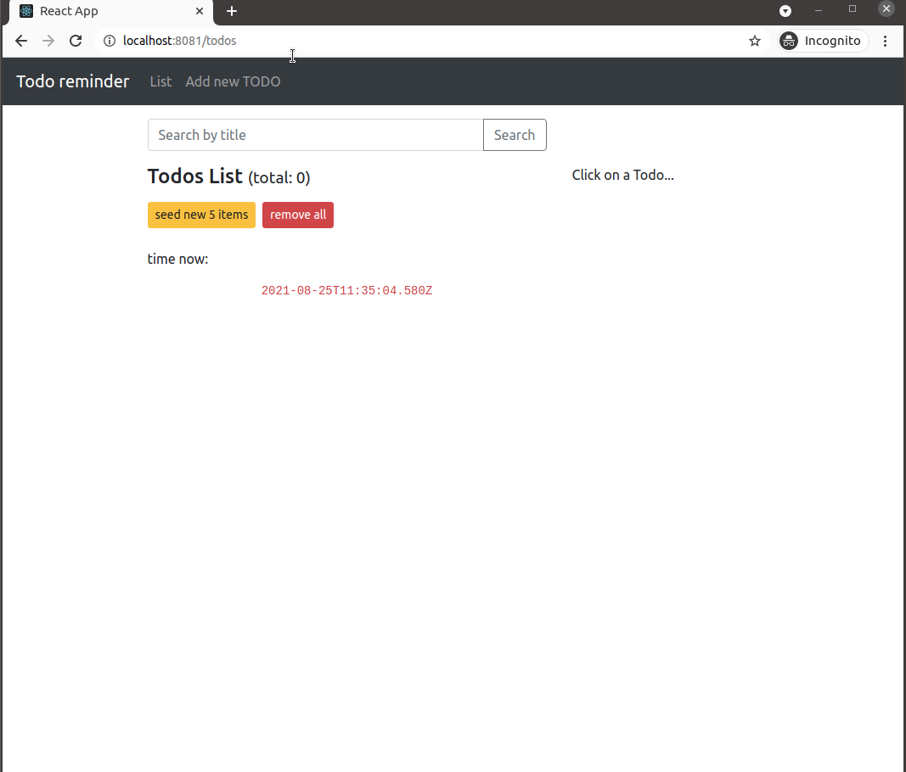

# To Do Reminder 

A simple React-Redux-Node-Express app

 

client: http://listmysolution.com:3000/
 
server: http://listmysolution.com:8000/todos

 

demo:  

 

run: 

`$ docker-compose up -d --build  --remove-orphans`

